# User Scenarios & Core System Flows

This document outlines the expected user interaction paths and maps how the backend architecture should process these requests in real-time. This provides the AI agents with architectural "landmarks" to ensure correct state routing and execution.

## 1. Core End-to-End Sequence Diagram

This Mermaid diagram illustrates the lifecycle of a standard Chat Request, integrating RAG, the Thinking UI, and Tool execution.

```mermaid
sequenceDiagram
    participant U as User (Iframe Widget)
    participant N as Nginx Gateway
    participant SIO as Socket.IO (FastAPI)
    participant LG as LangGraph State
    participant PG as PostgreSQL (pgvector)
    participant LLM as LiteLLM (Proxy Router)
    participant WS as External Tools (MCP/Celery)

    U->>N: 1. Send Msg: "Tôi muốn tạo Xweb" (Secure JWT via Socket.io auth)
    N->>SIO: Forward WSS Stream
    
    rect rgb(30, 30, 30)
        Note over SIO, LG: Pre-Processing Phase
        SIO->>SIO: 2. Auth.py (Check JWT)
        SIO->>SIO: 3. Create Redis Lock (timeout=30)
        SIO->>SIO: 4. pii_scrubber.py (Mask Sensitive Data)
        SIO->>LG: 5. Inject Message into State
    end

    rect rgb(20, 40, 60)
        Note over LG, PG: Generation Phase (LangGraph)
        LG->>PG: 6. nodes/rag_search.py (Cosine Similarity)
        PG-->>LG: Return Docs (Score: 0.85)
        
        LG->>LLM: 7. Stream Request (Prompt + Context)
        
        opt Stream Internal Thoughts
            LLM-->>LG: <thinking> Tôi cần gọi tool create_xweb </thinking>
            LG-->>SIO: Extract <thinking> tags
            SIO-->>U: Emit "thought_stream" event (Renders Accordion UI)
        end
        
        LLM-->>LG: Call Tool: create_xweb
    end

    rect rgb(60, 20, 20)
        Note over LG, WS: External Tool Execution Phase (MCP)
        LG->>WS: 8. Execute Tool via MCP Server
        
        opt Human-In-The-Loop (HITL)
            WS->>Manager: Telegram: Approve UUID?
            Manager-->>WS: Approved via Webhook
        end
        
        WS-->>LG: Action Success (Return ToolMessage)
    end

    rect rgb(20, 60, 20)
        Note over LG, U: Cleanup & Response
        LG->>LLM: 9. Stream final answer using Tool Result
        LLM-->>LG: "Xweb đã được tạo thành công!"
        LG-->>SIO: Token stream mapping
        SIO-->>U: Emit "chat_response" event
        SIO->>SIO: 10. redis_client.lock.release()
    end
```

---

## 2. Specific User Scenarios

### Scenario A: The "Safe" RAG Query
**Goal**: User asks a generic question covered by internal ISO documents.

- **User Action**: "Tiêu chuẩn ISO 9001 năm 2015 của công ty là gì?"
- **Gateway**: Text payload passes `validators.py`.
- **Middleware**: Passes `pii_scrubber` unmodified.
- **RAG Node**: Queries `pgvector` -> Finds Document X with **Score 0.92 (> 0.7)**.
- **LLM Node**: Receives System Prompt + RAG Context. Generates answer natively.
- **Socket**: Streams normal `chat_response` tokens to frontend.

### Scenario B: The "Hallucination" Trap
**Goal**: User asks about a competitor's product not in the database.

- **User Action**: "Giá phần mềm kế toán MISA bên bạn bán bao nhiêu?"
- **RAG Node**: Queries `pgvector` -> Best match is an irrelevant document with **Score 0.35 (< 0.7)**.
- **LangGraph Conditional Edge**: *CRITICAL PATH* -> The graph explicitly detects the score is below the `rules.yaml` threshold. It bypasses the LiteLLM generation node ENTIRELY.
- **Socket**: Emits hardcoded fallback string: *"Xin lỗi, tôi chưa rõ tài liệu này. Vui lòng để lại SĐT / Email để nhân viên CSKH hỗ trợ bạn."*

### Scenario C: The "Heavy File Upload" Attack
**Goal**: User attempts to dump an unknown file to crash the server.

- **User Action**: Uploads a 200MB `malware.exe` or `report.pdf`.
- **Nginx/Gateway**: Fast failure. The `validators.py` blocks the request because the MIME type is not `image/png`, `image/jpeg`, or `audio/webm`.
- **Socket**: Instantly returns a 400 JSON error: *"Chỉ chấp nhận file Ảnh hoặc Audio."* Backend LangGraph state is never touched.

### Scenario D: The "PII Leak" Threat
**Goal**: User accidentally pastes sensitive credentials.

- **User Action**: "Tạo xweb cho khách hàng Nguyễn Văn A, SĐT: 0912345678, Mật khẩu hệ thống: Admin@123".
- **Middleware Zone**: The message passes into `pii_scrubber.py`.
- **Scrubber Action**: Regex identifies the phone format and common password structure. The payload is modified in-memory.
- **LangGraph State**: The message injected to the AI is: `"Tạo xweb cho khách hàng Nguyễn Văn A, SĐT: [REDACTED], Mật khẩu hệ thống: [REDACTED]"`.
- **LiteLLM / Database Tracker**: Only the scrubbed version is sent to OpenAi/Anthropic, and only the scrubbed version is logged to the Postgres `Conversations` table.

### Scenario E: The Voice-Command "Action" Flow
**Goal**: User holds microphone to issue an external tool action.

- **User Action**: Speaks: "Check server status" -> Sends `audio/webm` via Socket.io.
- **Multimodal Node**: `audio.py` receives the bytes -> Buffers into `pydub`/FFmpeg to conform to `WAV` -> Hits local Whisper STT model.
- **Text Injection**: The translated string "Kiểm tra trạng thái server" is injected into LangGraph as a `HumanMessage`.
- **LiteLLM**: The model decides it must call the `check_server` tool.
- **Completion**: Tool returns success -> LiteLLM streams: "Hệ thống đang hoạt động bình thường."

### Scenario F: The "Infinite Greeting" Loop
**Goal**: User repeatedly says "Xin chào", "Alo" without providing context.

- **User Action**: "Xin chào" -> LLM responds "Chào bạn, tôi có thể giúp gì?" -> User says "Alo" again.
- **Memory Check**: LangGraph `MemorySaver` pulls the `thread_id` and sees the recent history. 
- **System Prompt Router**: The prompt explicitly forces the LLM to guide the user towards the platform's core functions (RAG / Tools) instead of looping small talk.
- **Response**: "Chào bạn! Tôi là trợ lý Smart-Bot. Bạn có câu hỏi nào về tiêu chuẩn ISO, phần mềm Xweb, hay cần tra cứu tài liệu nội bộ không?"

### Scenario G: The "Off-Topic" Distraction
**Goal**: User tries to chat about completely unrelated topics (e.g., coding advice, politics, jokes).

- **User Action**: "Bạn kể cho tôi một câu chuyện cười được không?" hoặc "Viết cho tôi đoạn code Python."
- **RAG Node**: Queries `pgvector` -> Score is `< 0.7` (No relevant company docs).
- **Tool Node**: Intent router determines no MCP tool is relevant.
- **Persona Rules**: The `prompts/templates` strictly restrict the AI's domain.
- **LLM Node/Response**: The AI politely refuses and redirects: "Xin lỗi, tôi là trợ lý AI nội bộ của công ty chuyên hỗ trợ về sản phẩm Xweb và tài liệu ISO. Tôi không thể hỗ trợ các chủ đề bên ngoài. Bạn cần tra cứu thông tin gì về công ty chúng ta không?"

### Scenario H: The "Utility Tool" Request
**Goal**: User explicitly requests contextual real-time data like current time or weather, which RAG cannot provide.

- **User Action**: "Hôm nay là thứ mấy, mấy giờ rồi? Và thời tiết Hà Nội thế nào?"
- **LLM Intent/Router**: RAG context is bypassed. LLM recognizes intent for real-time external data.
- **MCP Execution**: 
  1. Identifies `get_current_time` -> Executes locally on backend to get ISO 8601 timestamp.
  2. Identifies `get_city_weather` -> Calls `basic_tools` MCP Server -> Makes REST API requests to `geocoding-api.open-meteo.com` (for lat/lng) and `api.open-meteo.com` (for weather).
- **Thinking UI**: `<thinking> Đang gọi api open-meteo để lấy thời tiết Hà Nội... </thinking>`
- **Response**: LLM merges the tool outputs: "Bây giờ là 15:30 Thứ Sáu, ngày 25/10/2026. Thời tiết tại Hà Nội hiện tại đang có mưa nhỏ, nhiệt độ 24°C."
